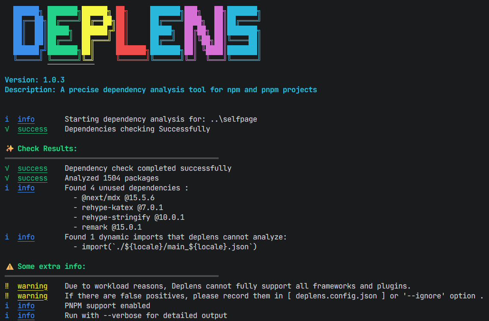

# Deplens

[简体中文](./assets/README_cn.md)



Deplens is a dependency usage analysis tool specifically designed for npm and pnpm projects. It can more accurately analyze whether Nodejs dependencies are used in various environments, filter out redundant and useless dependencies, and help developers optimize project structure and reduce the size of dependency libraries.

## Features

- **Precise Analysis**: It can leverage the non-nested, content-addressable storage feature of pnpm to more accurately identify the usage of dependencies in a pnpm environment.
- **High Compatibility**: It supports both npm and pnpm, the two commonly used package managers, and can analyze the two widely used lockfile versions, pnpm-lock.yaml v6 and v9. It also supports customizing ignored directories through configuration files and command parameters.
- **Complete Dependency Graph**: It not only analyzes the references in the project source code but also recursively analyzes the reference relationships of the dependent packages themselves.
- **Lower False Positive Rate**: By constructing a complete "dependency usage graph", it accurately determines whether each declared dependency is actually used.

## Technical Implementation

- Parse the file structure of `package-lock.json` or `pnpm-lock.yaml`, analyze the dependency relationships among each dependency, and build a complete dependency relationship view.
- Use `@babel/parser` and `@babel/traverse` to perform AST static analysis on the project source code.
- Propagate the dependency usage status through BFS/DFS algorithms.

## Why Deplens?

The initial purpose of Deplens was to address the issue of false positives caused by the fact that traditional detection tools on the market generally cannot analyze the complex reference relationships among dependencies in `node_modules`. It can more accurately analyze whether Nodejs dependencies are used in various environments. For a simple example:

Suppose we have a project that uses `react` as the technology stack, and somewhere in the project, a certain module provided by `react-dom` is directly used to implement a certain function. At this point, `react-dom` has indeed been referenced. So in the `packages.json`, it would probably look like this:

```json
{
  "dependencies": {
    "react": "19.2.0",
    "react-dom": "19.2.0"
  }
}
```

Now, let's assume that in a certain optimization, we used another more mature dependency library to implement the part of the logic that was originally implemented with `react-dom`. At this point, `react-dom` would not be introduced in the project. In traditional dependency analysis, but the package.json itself has not been changed, so intuitively, `react-dom` seems to be a redundant dependency and can be uninstalled to reduce the project size. And in some traditional tools, similar situations do occur (of course, common cases like `react-dom` won't happen, after all, this framework is too commonly used).

However, the fact is that `react` itself requires `react-dom` as its peer dependency. That is to say, `react-dom` has a role in the project. Without this dependency, `react` cannot run normally, so it cannot be uninstalled.

Deplens analyzes the dependency graph of a project through lockfiles (such as `package-lock.json` and `pnpm-lock.yaml`), recursively analyzing the reference relationships of the dependent packages themselves, thereby accurately determining whether each declared dependency is actually used, and thus filtering out truly redundant and useless dependencies. This addresses the shortcomings of traditional tools and enhances the credibility of the results.

## Situations that Deplens Cannot Analyze

Even though Deplens has taken into account the dependency usage in most scenarios during the development stage, it is known that there are still some situations that Deplens cannot handle, mainly including the following types:

Dynamic imports (such as `import('module')` or `require(constantValue)`), Deplens cannot analyze the usage of these dependencies because dynamic imports are determined at runtime, while Deplens can only statically analyze the project code. Although in the context, Deplens attempts to perform constant folding on some analyzable code, in most cases, the content of dynamic imports is not fully determined, and thus cannot be analyzed as static content.

- When introducing dependencies, custom syntax is used (such as `require("@babel/core").transformSync("code", { plugins: ["transform-minify-booleans"] });`), these introduction methods do not belong to the standard syntax format but are a special introduction method provided by the plugin itself. Therefore, Deplens cannot analyze the usage of these dependencies.

If you find some references that you are sure of but Deplens fails to detect, it might be due to the above issue. You can solve this problem by configuring ignored dependencies through [**Configuring Ignored Dependencies**](#ignored-dependencies) (see below).

Of course, if you are willing to help us improve the functions of Deplens, you are also welcome to submit a PR or an Issue. We will handle it as soon as possible.

## Installation

```bash
npm install @aquaori/deplens -g
```

This command will directly install deplens to the global environment, and you can use this tool in any project. If you only need to use this tool in the current project and do not want to install it to the global environment, you can use the following command:

```bash
npm install @aquaori/deplens --save-dev
```

This command will install `deplens` into the `devDependencies` of the current project. You can view this dependency in the project's `package.json` file.

## Usage

```bash
# Get the tool version number.
deplens -v

## Get Help
deplens -h

# Analyze the current project dependencies
deplens check
```

Optional parameters:

- `--path` (`-p`): Specifies the project path to be analyzed. The default is the current directory.
- `--pnpm` (`--pn`): Specifies that the project uses pnpm as the package manager. The default is npm.
- `--silence` (`-s`): Silent mode. No progress bar will be output.
- `--ignoreDep` (`-id`): Specifies the dependencies to be ignored. Multiple dependencies should be separated by a comma (`,`).
- `--ignorePath` (`-ip`): Specifies the paths to be ignored. Multiple paths should be separated by a comma (`,`).
- `--ignoreFile` (`-if`): Specifies the files to be ignored. Multiple files should be separated by a comma (`,`).
- `--config` (`-c`): Specifies the path to the custom configuration file.
- `--verbose` (`-V`): Verbose mode. All analysis results, including dev dependencies, will be output.

If you installed it using the `--save-dev` parameter instead of a global installation, you cannot directly use the `deplens` command. Instead, you need to run the tool in the following way:

```bash
npx @aquaori/deplens check
```

## Configuration File

If you want greater freedom, you can create a configuration file named `deplens-config.json` in the directory where the command is run.

### Ignoring Dependencies

To simplify the operation, Deplens natively supports ignoring some common files and directories:

```javascript
["/node_modules/", "/dist/", "/build/", ".git", "*.d.ts"];
```

But if you still need to ignore some other dependencies, paths and files, you can customize them in the configuration file:

```json
{
  "ignoreDep": ["nodemon"],
  "ignorePath": ["/test"],
  "ignoreFile": ["/tsconfig.json"]
}
```

In this way, when the command is run, the configuration files in the directory will be automatically read, and the analysis of the dependencies, paths, and files mentioned in them will be skipped.

Alternatively, you can use the `--config` or `-c` parameter when running the command to specify a configuration file. It doesn't have to be in the current directory; it can be anywhere on the local machine, for example:

```bash
deplens check -c D:\deplens-config.json
```

Or, if you don't want to create a configuration file for each project, you can also directly use the `--ignoreDep`, `--ignorePath`, and `--ignoreFile` parameters when running the command to specify the dependencies, paths, and files you want to ignore respectively. Multiple values should be separated by commas (`,`), for example:

```bash
deplens check -id nodemon,@next/mdx -ip /test,/dist -if /tsconfig.json
```

This command is completely equivalent to the configuration file above.

## Update Log

see the [chinese version](./assets/README_cn.md) file for more details.

## License

This project is licensed under the MIT Open Source License, which allows you to freely use, copy, modify, and distribute this software as long as you retain the copyright notice.
You can use Deplens for personal learning, commercial projects, or any other scenarios without paying any fees or assuming any warranty responsibilities.
For the complete terms of the MIT License, please visit the official page at [MIT License](https://opensource.org/licenses/MIT).

## Final Words

Thank you for choosing Deplens. The project is still in the refinement stage. If you encounter any issues during use, please feel free to submit an Issue or Pull Request to help improve this dependency analysis tool together!
