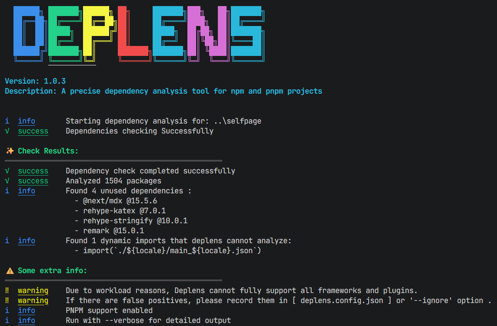

# Deplens

[中文说明](./assets/README_cn.md)



Deplens is a dependency analysis tool for Node.js projects. It combines AST-based static analysis, lockfile-aware dependency resolution, monorepo workspace inspection, and optional AI-assisted review to help identify:

- unused dependencies
- ghost dependencies
- undeclared workspace dependencies
- low-confidence dependency candidates that may still be used through tooling, config, or scripts

It supports both `npm` and `pnpm`, works in single-package and monorepo projects, and now includes an interactive `review` mode powered by LangChain and an LLM.

## Features

- **AST + Lockfile Analysis**: Deplens does not rely only on direct source imports. It combines source-code analysis with `package-lock.json` / `pnpm-lock.yaml` data for more reliable results.
- **Automatic Package Manager Detection**: It automatically chooses the correct `npm` or `pnpm` driver based on the target project and nearest applicable lockfile.
- **Monorepo Support**: Deplens detects npm/pnpm workspaces, analyzes each package independently, and aggregates package-level issues at the monorepo root.
- **Evidence Layer**: Analysis results are backed by structured declaration, reference, issue, and signal evidence instead of opaque conclusions.
- **Signals for Non-Standard Usage**: It records weak dependency-usage clues such as tooling strings, `require.resolve(...)`, and script commands to reduce false positives in real-world projects.
- **AI Review Mode**: The `review` command opens an interactive terminal assistant that can answer natural-language questions about dependency usage, package summaries, ghost dependencies, and removal risk.
- **AI Pre-Review for `check`**: The optional `--preReview` mode performs LLM-based secondary review for suspicious unused-dependency candidates and groups results into high-confidence unused, likely tooling-managed, and needs-manual-review buckets.
- **JSON Output**: In addition to human-readable CLI output, Deplens can export structured JSON reports for CI scripts, dashboards, or further tooling.

## Technical Implementation

- Parse source files with Babel-based AST analysis to extract direct dependency references from `import`, `require`, and supported dynamic import patterns.
- Parse lockfiles and manifests to resolve declared dependencies, workspace relationships, and package-manager-specific behavior in both single-package and monorepo projects.
- Build an evidence graph that records:
    - dependency declarations
    - dependency references
    - issue evidence
    - signal evidence for non-standard usage clues
- Expose evidence and high-level query APIs that can be reused by:
    - CLI reporting
    - JSON output
    - monorepo aggregation
    - LangChain tools
- Use LangChain to wrap project-aware tools for AI review, so the model works on structured project data rather than answering only from general knowledge.
- Perform secondary review only for low-confidence candidates instead of all dependencies, which keeps token usage and review latency under control.

## Why Deplens?

Many dependency-checking tools stop at direct source imports. That works for simple projects, but it breaks down in real-world cases such as:

- monorepo workspace packages
- lockfile-driven installation behavior
- config-only or tooling-only dependency usage
- scripts that reference dependencies without normal imports
- plugin or preset strings used in build pipelines

Deplens is built to handle those cases more explicitly. Instead of outputting only a flat unused list, it tries to answer:

- Is this dependency truly unused?
- Is it referenced but undeclared?
- Is it likely being used indirectly through tooling or config?
- Is this result high-confidence, or should it be reviewed manually?

That is the main reason Deplens now includes evidence, signals, AI review, and pre-review flows.

## Situations that Deplens Cannot Fully Analyze

Deplens still starts from static analysis, so there are limits:

- **Runtime-dependent imports** such as `import(variable)` or `require(variable)` cannot always be resolved precisely.
- **Framework-specific conventions** may hide dependency usage behind custom loaders, generated code, or runtime hooks.
- **Alias and virtual specifiers** may still appear as ghost-like references if they do not map cleanly to real npm package names.
- **AI review is assistive, not magical**. It improves low-confidence cases, but it does not replace deterministic static analysis or real runtime execution.

Because of that, Deplens separates:

- high-confidence deterministic analysis
- suspicious low-confidence candidates
- optional AI-assisted secondary review

## Installation

```bash
npm install -g @aquaori/deplens
```

This installs Deplens globally so that the `deplens` command can be used anywhere.

If you only want to use it in the current project:

```bash
npm install --save-dev @aquaori/deplens
```

## Usage

```bash
# Show version
deplens -v

# Show help
deplens -h

# Analyze the current project
deplens check

# Start interactive AI review
deplens review
```

### `check`

```bash
# Analyze the current project
deplens check

# Analyze a specific project
deplens check -p D:\my-project

# Export JSON to stdout
deplens check --json

# Export JSON to a file
deplens check --json -o deplens-report.json

# Run AI pre-review for suspicious unused candidates
deplens check --preReview
```

`--preReview` is optional and only needed if you want AI-assisted secondary review for suspicious unused-dependency candidates.

**Please note**: The `preReview` process may **consume more tokens** and seriously slow down the startup and analysis speed of Deplens, especially in some complex Monorepo projects, so in order to save tokens and optimize the user experience, whether it is `check` or `review`, this mode will not be enabled by default unless you request it. Before enabling this feature, please also ensure that you have enough tokens for review to avoid affecting the subsequent user experience.

### `review`

```bash
# Start interactive review mode
deplens review

# Review a specific project
deplens review -p D:\my-project

# Start review mode with AI pre-review enabled before chat
deplens review --preReview
```

The `review` command:

- scans the project once
- builds a project snapshot
- exposes project-aware tools to the LLM
- lets you ask natural-language questions in an interactive terminal UI

Typical questions:

- Which dependencies are truly unused?
- Which packages have the most dependency issues?
- Can I remove `react-dom` safely, and why?
- Why does this package look unused even though the project still runs?

### Common options

- `--path` (`-p`): Project path to analyze. Defaults to the current directory.
- `--silence` (`-s`): Silent mode. Suppresses normal CLI output.
- `--ignoreDep` (`-id`): Ignore dependencies. Multiple values separated by commas.
- `--ignorePath` (`-ip`): Ignore paths. Multiple values separated by commas.
- `--ignoreFile` (`-if`): Ignore files. Multiple values separated by commas.
- `--config` (`-c`): Path to a custom configuration file.
- `--verbose` (`-V`): Verbose mode.
- `--json` (`-J`): Output analysis as JSON.
- `--output` (`-o`): Write generated output to a file.
- `--preReview`: Enable optional AI secondary review for suspicious unused candidates.

If you installed Deplens locally instead of globally:

```bash
npx @aquaori/deplens check
```

## Configuration File

If you want more control, create a `deplens.config.json` file in the project directory.

### Ignore Rules

Deplens ignores some common build/output paths by default:

```javascript
["/node_modules/", "/dist/", "/build/", ".git", "*.d.ts"];
```

You can extend ignore rules with configuration:

```json
{
    "ignoreDep": ["nodemon"],
    "ignorePath": ["/test"],
    "ignoreFile": ["/tsconfig.json"]
}
```

You can also point to a custom config file explicitly:

```bash
deplens check -c D:\deplens.config.json
```

Or pass ignore rules directly through CLI arguments:

```bash
deplens check -id nodemon,@next/mdx -ip /test,/dist -if /tsconfig.json
```

### AI Review Environment Variables

`review` and `check --preReview` require AI configuration.

Create a `.env` file or set environment variables:

```env
QWEN_MODEL=qwen-plus
QWEN_API_KEY=your_api_key
QWEN_BASE_URL=https://dashscope.aliyuncs.com/compatible-mode/v1
```

If these variables are missing, Deplens will refuse to enter AI-assisted flows and tell you which fields are missing.

## Update Log

- 1.2.0
    - Added LangChain-powered interactive `review` mode.
    - Added optional `--preReview` flow for AI-assisted secondary review in `check`.
    - Added structured evidence and signal collection for non-standard dependency usage clues.
    - Added dependency review candidates and low-confidence classification.
    - Added local code-context bundle support for dependency review and explanation.
    - Added interactive terminal UI for `review`, including status feedback and structured answer rendering.
    - Added AI configuration validation before entering review-related flows.

- 1.1.0
    - Added automatic package manager detection for both single-package and monorepo analysis.
    - Added monorepo workspace analysis for npm and pnpm workspaces.
    - Added JSON report output with `--json` and file export support through `--output`.
    - Added lockfile resolution based on the nearest applicable workspace package path.
    - Improved CLI output for monorepo mode, including compact package summaries and better progress handling.
    - Fixed BOM-related `package.json` parsing issues in workspace packages.
    - Fixed CLI processes not exiting automatically after analysis.
    - Fixed monorepo output issues caused by dynamic imports being rendered as `undefined`.
    - Reduced noisy non-essential stderr output produced during transpilation.

- 1.0.7
    - Improved `.vue` file analysis support.

- 1.0.6
    - Fixed several CLI and ignore-rule related issues.

- 1.0.5
    - Optimized logger behavior and result output.

- 1.0.4
    - Fixed `.vue` transpilation edge cases.

- 1.0.3
    - Added `.vue` support.
    - Improved output formatting and ignore options.

- 1.0.2
    - Fixed initial release issues.

- 1.0.1
    - Fixed dynamic import parsing issues.

- 1.0.0
    - Initial release.

## License

This project is licensed under the MIT License.

You are free to use, modify, copy, and distribute Deplens in personal or commercial projects as long as the copyright notice is preserved.

For the full license text, see [MIT License](https://opensource.org/licenses/MIT).

## Final Words

Deplens is no longer just a flat dependency checker. It is gradually evolving into a dependency-governance assistant built on top of:

- deterministic static analysis
- structured evidence
- monorepo-aware aggregation
- low-confidence candidate review
- AI-assisted interactive explanation

Although the project has been tested in various environments before launching, the actual scenarios are usually more complex, and if you encounter wrong conclusions, framework compatibility issues, or some monorepo boundary scenarios in real projects, please submit an issue or pull request. Feedback from real projects is the fastest way to continue polishing Deplens.
